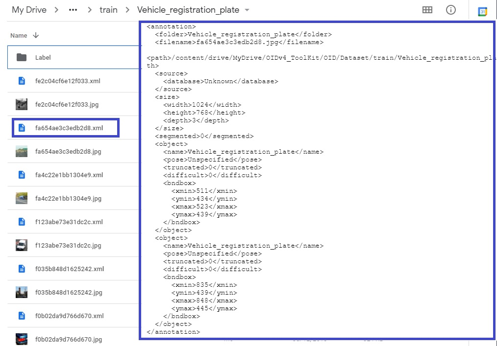

# Dataset for yolo3 object detection

## Tool kit installation for downloading Open Images Dataset
[Open Images Dataset V6 + Extensions](https://storage.googleapis.com/openimages/web/index.html) - 15,851,536 boxes on 600 categories

    git clone https://github.com/pythonlessons/OIDv4_ToolKit.git
    
## Upload OIDv4_ToolKit to your google drive

## How to access your google drive on Colab code
    import os
    from google.colab import drive
    drive.mount('/content/drive', force_remount=True)
    os.chdir('/content/drive/MyDrive/OIDv4_ToolKit')
    
## Set up python environment
    !pip pip install -r ./OIDv4_ToolKit/requirements.txt
   
## Download 2000 train images to your google drive
    !python main.py downloader --classes 'Vehicle registration plate' 'Traffic sign' 'Traffic light' Car Bus Truck Person --type_csv train --limit 2000

## Download 200 test images to your google drive
    !python main.py downloader --classes 'Vehicle registration plate' 'Traffic sign' 'Traffic light' Car Bus Truck Person --type_csv test --limit 200

### Check if mages and Label texts are downloaded in OID/Dataset/train(test) and  OID/Dataset/train(test)/Label

## Convert annotaion label to XML format
    !python ./oid_to_pascal_voc_xml.py

      
## Convert XML to YOLO v3 file structure
    !python ./voc_to_YOLOv3.py
    (Warning) replace directory character('//') with os.sep in the source code
OIDv4_ToolKit/4_CLASS_test.txt & 4_CLASS_test_classes.txt are created.

